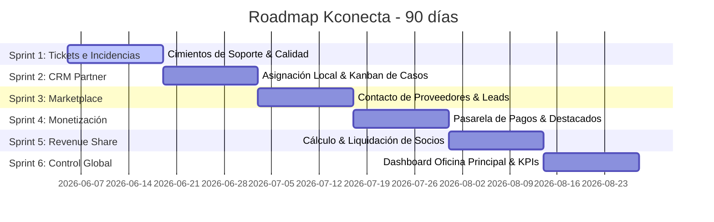

# Plan de Ejecución de Backlog & Roadmap: Kconecta (90 días)

Este documento detalla el backlog técnico-funcional estructurado para el proyecto Kconecta, diseñado para ordenar y acelerar el desarrollo sobre la baseline de producción actual sin interrumpir la operatividad existente.

---

## 1. Resumen Ejecutivo
Para consolidar la base transaccional y el CRM de Kconecta de forma segura, planteamos un plan de 90 días organizado en **6 sprints de 2 semanas**. La estrategia prioriza un esquema de **bajo riesgo sobre la producción actual**, aislando las nuevas entidades y funcionalidades complejas en fases posteriores, y maximizando la entrega de valor temprano mediante "Quick Wins".
Se respetan estrictamente los roles definidos: **Propietario**, **Gestor inmobiliario / Partner Kconecta**, **Proveedor de servicios**, **Cliente**, y **Kconecta oficina principal**.

---

## 2. Roadmap Propuesto por Sprint (90 Días)



### Sprint 1: Cimientos de Soporte y Flujo de Calidad (Tickets de Incidencias)
*   **Objetivo**: Introducir la infraestructura de reporte de incidencias (Tickets) básica y robustecer el flujo de validación/voto de Proveedores para evitar fricciones operativas iniciales.
*   **Resultado esperado**: Flujo funcional de creación, seguimiento e histórico de tickets para Propietarios y Gestores inmobiliarios. Consolidación de endpoints para Work Codes.
*   **Dependencia**: Ninguna (Baseline de producción estable).
*   **Nivel de riesgo**: Bajo (Estructura de datos aislada, sin modificar flujos core de ventas).
*   **Impacto esperado**: Alto incremento en la confianza del usuario y resolución temprana de bloqueos transaccionales.

### Sprint 2: CRM Enterprise Fase 1 (Asignación de Gestor Local & Kanban de Casos)
*   **Objetivo**: Implementar la selección/asignación inteligente de Gestores locales basada en código postal y permitir la asignación manual por Comunidad Autónoma/región, además de habilitar el panel Kanban para Partners Kconecta.
*   **Resultado esperado**: Un buscador/selector de Gestores para el Propietario por Comunidad Autónoma, un tablero Kanban interactivo para el Gestor donde gestiona aceptación, estados y cierre de sus casos.
*   **Dependencia**: Sprint 1 (vínculo de incidencias/tickets a propiedades).
*   **Nivel de riesgo**: Medio (Modifica el guardado, consulta e indexación geográfica de Gestores).
*   **Impacto esperado**: Flexibilidad en la asignación de propiedades y automatización de la operación del Partner.

### Sprint 3: Marketplace Transaccional Fase 1 (Contacto Directo & Solicitudes a Proveedores)
*   **Objetivo**: Habilitar el flujo de contacto, cotización e interacción directa entre Clientes/Propietarios y Proveedores de servicios desde la ficha pública.
*   **Resultado esperado**: Formularios de contacto dinámicos en fichas, historial de contactos en perfiles y recuento de leads.
*   **Dependencia**: Sprint 2 (reutilización de la lógica geográfica y de notificaciones).
*   **Nivel de riesgo**: Bajo-Medio (Afecta principalmente la interfaz pública de proveedores sin modificar pasarelas de pago).
*   **Impacto esperado**: Incremento significativo de leads enviados a proveedores, impulsando la tracción comercial.

### Sprint 4: Monetización Madura Fase 1 (Planes y Pasarela de Pagos)
*   **Objetivo**: Integrar pasarela de pago (Stripe) para permitir suscripciones o pagos únicos para que Proveedores puedan destacar su servicio en buscador/mapa.
*   **Resultado esperado**: Flujo de checkout web funcional, panel de gestión de cobros y activación automática de tags "Destacado".
*   **Dependencia**: Sprint 3 (requiere interacciones de negocio activas para justificar el cobro).
*   **Nivel de riesgo**: Medio-Alto (Introducción de pasarelas, Webhooks e implicaciones de facturación).
*   **Impacto esperado**: Primera fuente de ingresos directos automatizados para la plataforma.

### Sprint 5: Automatización de Revenue Share & Liquidaciones
*   **Objetivo**: Definir las reglas de negocio y cálculo automatizado de reparto de ingresos entre Partners Kconecta (Gestores) y Kconecta Oficina Principal.
*   **Resultado esperado**: Cron jobs automatizados de liquidación de comisiones periódicas, con reportes detallados en backoffice.
*   **Dependencia**: Sprint 4 (requiere la pasarela de pagos operativa para procesar e imputar entradas monetarias).
*   **Nivel de riesgo**: Alto (Reglas financieras internas sensibles a auditoría).
*   **Impacto esperado**: Reducción de carga administrativa manual al 0% y transparencia con los Partners.

### Sprint 6: Portal de Control Kconecta Oficina Principal (Dashboard Consolidado & Analytics)
*   **Objetivo**: Proporcionar a la administración central de Kconecta las herramientas necesarias para supervisar el ecosistema de forma global.
*   **Resultado esperado**: Panel global con métricas de monetización, volumen de transacciones, calidad de Gestores (ratings), volumen de tickets y control operativo total.
*   **Dependencia**: Sprint 5 (para conservar datos de liquidaciones y revenue share).
*   **Nivel de riesgo**: Bajo (Funcionalidades principalmente de lectura y exportación).
*   **Impacto esperado**: Gobernanza operativa del 100% para la toma de decisiones basada en datos.

---

## 3. Issues por Sprint (Formato GitHub)

### Sprint 1: Cimientos de Soporte y Flujo de Calidad

#### Issue #1.1: [DATABASE] Estructura y modelos para módulo de Soporte (Tickets)
*   **Prioridad**: Alta
*   **Labels**: `backend`, `database`, `sprint-1`
*   **Descripción**: 
    Crear la estructura de tablas para soportar el flujo de incidencias en Kconecta. Un Ticket puede ser creado por un Propietario o Gestor y debe estar vinculado opcionalmente a un Inmueble/Caso.
    *Tablas a crear*: `tickets` (id, user_id, property_id, subject, description, status [open, in_progress, resolved, closed], priority [low, medium, high], created_at, updated_at) y `ticket_messages` (id, ticket_id, user_id, message, attachments_json, created_at).
*   **Criterios de Aceptación**:
    - [ ] Migración escrita aplicando el protocolo de seguridad de Laravel (`migrations` legacy compatible).
    - [ ] Modelos `Ticket` y `TicketMessage` creados con relaciones correctas.
    - [ ] Seeders iniciales para estados y prioridades.
    - [ ] Unit tests de creación y asociación aprobados.
*   **Dependencias**: Ninguna
*   **Impacto Negocio**: Habilita la resolución estructurada de incidencias, reduciendo el soporte manual vía email.
*   **Riesgo Técnico**: Bajo.

#### Issue #1.2: [WEB/API] UI y Endpoints para Creación y Seguimiento de Tickets
*   **Prioridad**: Alta
*   **Labels**: `frontend`, `api`, `sprint-1`
*   **Descripción**: 
    Desarrollar la interfaz web (Blade) para que Propietarios y Gestores puedan crear y responder a sus propios tickets. Además, exponer endpoints REST en la API v1 para compatibilidad móvil futura.
*   **Criterios de Aceptación**:
    - [ ] Formulario accesible desde backoffice (/post/tickets) que permita abrir incidencias.
    - [ ] Visualización de listado de tickets personales y vista de detalle (hilo de conversación).
    - [ ] Endpoint `POST /api/v1/tickets` y `GET /api/v1/tickets` implementados con tests API validados.
    - [ ] No permite ver tickets de terceros (aislamiento por `user_id`).
*   **Dependencias**: #1.1
*   **Impacto Negocio**: Mejora la experiencia del cliente interno y externo del CRM.
*   **Riesgo Técnico**: Bajo.

#### Issue #1.3: [BACKEND] Refuerzo y control de emisión de Work Codes para Proveedores
*   **Prioridad**: Media
*   **Labels**: `backend`, `security`, `sprint-1`
*   **Descripción**: 
    Optimizar el flujo existente de `service_work_codes` para garantizar que los códigos generados no expiren de forma errónea, se autolimpien los antiguos y se eviten colisiones bajo concurrencia.
*   **Criterios de Aceptación**:
    - [ ] Agregar validación para evitar doble consumo simultáneo de un mismo código de trabajo (bloqueo optimista).
    - [ ] Generar tarea programada (Artisan) para invalidar códigos sin usar tras 30 días.
    - [ ] Integrar test de integración para concurrencia en la suite `ServiceRatingsApiTest`.
*   **Dependencias**: Baseline de Ratings ya desplegada.
*   **Impacto Negocio**: Evita falsificaciones o duplicación en la reputación pública de los proveedores.
*   **Riesgo Técnico**: Bajo-Medio.

---

### Sprint 2: CRM Enterprise Fase 1 (Asignación de Gestor Local & Kanban de Casos)

#### Issue #2.1: [BACKEND] Lógica de selección y asignación geográfica/regional de Gestores
*   **Prioridad**: Alta
*   **Labels**: `backend`, `sprint-2`
*   **Descripción**: 
    Implementar el flujo para asociar un caso/inmueble a un Gestor. El sistema debe sugerir automáticamente un Gestor local por coincidencia de código postal (`postal_code`). Si no coincide o se prefiere una asignación manual, el Propietario debe poder seleccionar de forma manual un Gestor registrado en la misma Comunidad Autónoma (CCAA) o región de la propiedad.
*   **Criterios de Aceptación**:
    - [ ] Registrar en el perfil del Gestor / Partner Kconecta las Comunidades Autónomas/regiones de actuación en las que opera.
    - [ ] Modificar `GestorSelectorService` para exponer un método de búsqueda de Gestores filtrado por CCAA/región de la propiedad.
    - [ ] Habilitar en el formulario de creación/edición de propiedad del Propietario un selector dinámico que liste los Gestores asociados a la CCAA/región correspondiente para su asignación manual.
    - [ ] Tests unitarios y de integración cubriendo la sugerencia automática por código postal y la selección manual por Comunidad Autónoma.
*   **Dependencias**: Baseline de propiedades y perfiles.
*   **Impacto Negocio**: Facilita la asignación flexible y descentralizada de propiedades en zonas donde no hay Gestores hiperlocales por código postal pero sí regionales.
*   **Riesgo Técnico**: Medio.

#### Issue #2.2: [WEB] Tablero Kanban de Casos para Gestores inmobiliarios / Partners
*   **Prioridad**: Alta
*   **Labels**: `frontend`, `sprint-2`
*   **Descripción**: 
    Crear una vista interactiva de gestión para el Gestor donde pueda ver los casos e inmuebles asignados agrupados por su estado (`Propuesto`, `Aceptado`, `En Gestión`, `Cerrado`, `Rechazado`).
*   **Criterios de Aceptación**:
    - [ ] Interfaz limpia en CSS nativo y Blade, evitando librerías pesadas externas para mantener el rendimiento.
    - [ ] Acciones directas para "Aceptar" o "Rechazar" un caso propuesto por el propietario.
    - [ ] El cambio de estado activa el registro histórico en base de datos.
*   **Dependencias**: #2.1
*   **Impacto Negocio**: Incrementa la eficiencia operativa del Gestor al tener un control visual centralizado de su cartera de propiedades activas.
*   **Riesgo Técnico**: Bajo.

#### Issue #2.3: [API] Integración de endpoints de gestión de casos para App Móvil
*   **Prioridad**: Media
*   **Labels**: `api`, `sprint-2`
*   **Descripción**: 
    Exponer las acciones de aceptación, rechazo y actualización de estado de propiedades/casos en la API v1 para que la app móvil nativa mantenga la paridad funcional con la versión web.
*   **Criterios de Aceptación**:
    - [ ] Endpoint `PATCH /api/v1/properties/{id}/status` implementado y documentado.
    - [ ] Endpoint `POST /api/v1/properties/{id}/assign` con validación de roles.
    - [ ] Protección de rutas: solo el Gestor asignado o la Oficina Principal pueden modificar el estado.
*   **Dependencias**: #2.2
*   **Impacto Negocio**: Permite al Gestor reaccionar inmediatamente en movilidad ante nuevos inmuebles.
*   **Riesgo Técnico**: Bajo.

---

### Sprint 3: Marketplace Transaccional Fase 1 (Contacto Directo & Solicitudes a Proveedores)

#### Issue #3.1: [DATABASE] Estructura de leads y contactos de servicios
*   **Prioridad**: Alta
*   **Labels**: `backend`, `database`, `sprint-3`
*   **Descripción**: 
    Modelar la persistencia de contactos dinámicos. Cuando un Cliente o Propietario escribe a un Proveedor, debe guardarse la traza para métricas de efectividad comercial.
    *Tabla*: `service_contacts` (id, provider_user_id, client_user_id, client_name, client_email, client_phone, message, source [web, mobile], created_at).
*   **Criterios de Aceptación**:
    - [ ] Migración con índices compuestos por `provider_user_id` y `created_at` para acelerar reportes.
    - [ ] Modelo `ServiceContact` con relaciones a usuarios y logs.
*   **Dependencias**: Ninguna (Aislado de tablas core).
*   **Impacto Negocio**: Aporta visibilidad del valor comercial que el Marketplace entrega a los Proveedores (Leads generados).
*   **Riesgo Técnico**: Bajo.

#### Issue #3.2: [WEB] Formulario de contacto en detalle de servicio y redirección de WhatsApp
*   **Prioridad**: Alta
*   **Labels**: `frontend`, `sprint-3`
*   **Descripción**: 
    Añadir en la vista pública del detalle del servicio (`details_service`) un formulario flotante de contacto directo y un botón optimizado de chat por WhatsApp. Ambos deben incrementar las métricas internas de KPIs.
*   **Criterios de Aceptación**:
    - [ ] Integración asíncrona (AJAX/Fetch) para el envío del formulario.
    - [ ] El clic en WhatsApp debe llamar internamente a la ruta de registro `/api/register-contact-click` antes de abrir la aplicación externa (WhatsApp Link).
    - [ ] Validación de campos obligatorios (nombre, correo/teléfono y mensaje).
*   **Dependencias**: #3.1, Baseline de métricas de servicio.
*   **Impacto Negocio**: Maximiza la conversión de visitas a contactos calificados en el Marketplace.
*   **Riesgo Técnico**: Bajo.

---

### Sprint 4: Monetización Madura Fase 1 (Suscripción y Fichas Destacadas)

#### Issue #4.1: [BACKEND] Integración básica de SDK de Pasarela de Pagos (Stripe)
*   **Prioridad**: Alta
*   **Labels**: `backend`, `integrations`, `sprint-4`
*   **Descripción**: 
    Instalar, configurar e integrar Stripe a nivel de backend para procesar pagos seguros, configurando las claves mediante variables de entorno para evitar hardcodeos en producción.
*   **Criterios de Aceptación**:
    - [ ] Composer require de la librería oficial de Stripe.
    - [ ] Wrapper / Service creado en `app/Services/PaymentService.php`.
    - [ ] Tests de integración simulando respuestas exitosas y fallidas del Gateway.
*   **Dependencias**: Ninguna.
*   **Impacto Negocio**: Prepara el motor financiero de Kconecta.
*   **Riesgo Técnico**: Medio-Alto.

#### Issue #4.2: [WEB/API] Compra de etiqueta "Destacado" para Proveedores
*   **Prioridad**: Alta
*   **Labels**: `frontend`, `backend`, `sprint-4`
*   **Descripción**: 
    Implementar el flujo completo donde un Proveedor compra una etiqueta de destaque temporal (ej. 30 días) para aparecer primero en las búsquedas y el mapa.
*   **Criterios de Aceptación**:
    - [ ] Añadir campo `is_featured_until` (datetime) a la tabla de servicios del proveedor.
    - [ ] Crear pantalla de "Promocionar Servicio" en el backoffice del proveedor con redirección a Stripe Checkout.
    - [ ] Implementar el endpoint del Webhook de Stripe para procesar el pago asíncrono y actualizar `is_featured_until`.
*   **Dependencias**: #4.1
*   **Impacto Negocio**: Monetización directa y orgánica de la base de Proveedores.
*   **Riesgo Técnico**: Alto (Manejo de Webhooks e integridad del estado de cobros).

---

### Sprint 5: Automatización de Revenue Share & Liquidaciones

#### Issue #5.1: [DATABASE] Modelo y estructura de comisiones y liquidaciones
*   **Prioridad**: Alta
*   **Labels**: `database`, `backend`, `sprint-5`
*   **Descripción**: 
    Definir el almacenamiento para el reparto de comisiones de transacciones realizadas por Gestores locales bajo el modelo de Revenue Share (Kconecta % vs Partner %).
    *Tablas*: `revenue_share_rules` (id, user_id [opcional para reglas personalizadas], partner_percentage, platform_percentage) y `partner_settlements` (id, partner_user_id, total_amount, commission_amount, status [pending, processed, paid], period_start, period_end, paid_at).
*   **Criterios de Aceptación**:
    - [ ] Migración ejecutada con validaciones de rangos numéricos de porcentajes (0-100).
    - [ ] Modelos y relaciones Eloquent establecidos.
*   **Dependencias**: Baseline de transacciones o cierre de casos.
*   **Impacto Negocio**: Formaliza contractualmente la relación económica con los Gestores.
*   **Riesgo Técnico**: Bajo.

#### Issue #5.2: [BACKEND] Motor de Cálculo e Imputación de Comisiones
*   **Prioridad**: Alta
*   **Labels**: `backend`, `sprint-5`
*   **Descripción**: 
    Crear el proceso de servidor (Artisan command programado) que calcule periódicamente el importe acumulado a liquidar por cada Gestor según las transacciones de inmuebles cerradas exitosamente durante el mes.
*   **Criterios de Aceptación**:
    - [ ] Comando `kconecta:generate-settlements` que procesa los casos finalizados y genera las filas en `partner_settlements`.
    - [ ] Generación automática de logs contables para auditoría interna de la Oficina Principal.
    - [ ] Robustez ante ejecuciones duplicadas (protección contra doble cálculo para un mismo periodo).
*   **Dependencias**: #5.1
*   **Impacto Negocio**: Automatización del control contable de la red de Partners.
*   **Riesgo Técnico**: Medio-Alto.

---

### Sprint 6: Portal de Control Kconecta Oficina Principal (Dashboard & Analytics)

#### Issue #6.1: [WEB] Panel de Control Global para Oficina Principal
*   **Prioridad**: Alta
*   **Labels**: `frontend`, `backend`, `sprint-6`
*   **Descripción**: 
    Crear una vista de control centralizada exclusiva para el rol de Kconecta Oficina Principal donde se presenten las métricas agregadas del ecosistema de manera intuitiva y visual.
*   **Criterios de Aceptación**:
    - [ ] KPIs clave visibles: Ingresos totales por destacados, Comisiones a pagar a Gestores, Cantidad de leads enviados a proveedores, Volumen de tickets abiertos/cerrados.
    - [ ] Tabla interactiva de listado de Gestores con su respectiva calificación media (Rating consolidado).
    - [ ] Filtro por rango de fechas en todas las gráficas/datos mostrados.
*   **Dependencias**: Todos los sprints anteriores.
*   **Impacto Negocio**: Herramienta definitiva para la toma de decisiones estratégicas del negocio y control de la calidad.
*   **Riesgo Técnico**: Bajo.

#### Issue #6.2: [WEB] Consolidación y Resolución de Tickets del Administrador
*   **Prioridad**: Media
*   **Labels**: `frontend`, `backend`, `sprint-6`
*   **Descripción**: 
    Desarrollar la interfaz administrativa de gestión de Tickets donde la Oficina Principal pueda ver todas las incidencias abiertas del sistema, reasignarlas, responder a los usuarios y marcarlas como resueltas.
*   **Criterios de Aceptación**:
    - [ ] Filtro rápido por estado (`Abierto`, `En proceso`, `Resuelto`).
    - [ ] Vista del hilo del ticket con editor enriquecido básico para soporte técnico.
    - [ ] Notificación por correo al usuario cuando su ticket sea actualizado o cerrado.
*   **Dependencias**: #1.1, #1.2
*   **Impacto Negocio**: Mejora del SLA de atención al cliente y retención de la plataforma.
*   **Riesgo Técnico**: Bajo.

---

## 4. Tabla de Clasificación de Issues

La siguiente tabla evalúa el impacto y viabilidad de cada una de las tareas propuestas para priorizar el desarrollo seguro sobre la baseline estable:

| Issue | Sprint | Impacto Técnico | Impacto Negocio | Riesgo Técnico | Paralelizable |
| :--- | :--- | :--- | :--- | :--- | :--- |
| **#1.1** BD Tickets | Sprint 1 | Bajo | Medio | Bajo | Sí |
| **#1.2** UI y APIs Tickets | Sprint 1 | Bajo | Alto | Bajo | Sí |
| **#1.3** Control de Work Codes | Sprint 1 | Bajo | Medio | Bajo | No |
| **#2.1** Asignación local Gestor | Sprint 2 | Medio | Alto | Medio | No |
| **#2.2** Kanban de Casos | Sprint 2 | Bajo | Alto | Bajo | Sí |
| **#2.3** API Casos App | Sprint 2 | Bajo | Medio | Bajo | Sí |
| **#3.1** BD Leads Proveedor | Sprint 3 | Bajo | Medio | Bajo | Sí |
| **#3.2** UI Formulario Ficha | Sprint 3 | Bajo | Alto | Bajo | Sí |
| **#4.1** SDK Stripe Backend | Sprint 4 | Medio | Medio | Medio | Sí |
| **#4.2** Destaques y Checkout | Sprint 4 | Alto | Alto | Alto | No |
| **#5.1** BD Revenue Share | Sprint 5 | Bajo | Medio | Bajo | Sí |
| **#5.2** Motor Liquidación | Sprint 5 | Alto | Alto | Medio | No |
| **#6.1** Panel Central Ops | Sprint 6 | Bajo | Alto | Bajo | Sí |
| **#6.2** Gestión Tickets Ops | Sprint 6 | Bajo | Medio | Bajo | Sí |

---

## 5. Quick Wins Recomendados

Se definen como "Quick Wins" aquellas tareas que ofrecen valor de negocio visible a corto plazo con un riesgo nulo de afectar los procesos transaccionales existentes de la base estable en producción:

1.  **Mapeo y Refuerzo de Work Codes (#1.3)**: 
    *   *Por qué*: El backend de valoraciones y códigos de trabajo ya se encuentra desplegado y validado. Reforzar el control de expiración de códigos y la protección ante ejecuciones concurrentes de la API estabiliza una funcionalidad operativa con mínima edición de código existente.
2.  **Mapeo de Base de Datos para Leads de Servicios (#3.1)**:
    *   *Por qué*: Crear la tabla aislada para `service_contacts` permite empezar a capturar información de contactos de proveedores sin interferir en ningún flujo de registro de usuarios o subida de inmuebles. Se puede desplegar la migración de forma segura y transparente.
3.  **UI de Tickets e Incidencias en Backoffice (#1.2)**:
    *   *Por qué*: Al ser un módulo autocontenido (con tabla propia y controladores específicos), no interacciona con los procesos de pasarela de pago o CRM de propiedades. Aporta valor inmediato para la capturación de incidencias operativas.

---

## 6. Tareas Paralelas Recomendadas

Para acelerar el delivery de los 90 días, sugerimos separar el equipo de trabajo en dos tracks independientes. Mientras el core de desarrollo backend implementa la lógica transaccional, otros perfiles o un sub-equipo técnico pueden trabajar de manera paralela en tareas de bajo acoplamiento:

*   **Documentación de Contratos de API Móvil (Paralelizable desde el Día 1)**:
    Redactar las especificaciones Swagger/OpenAPI para los nuevos endpoints de tickets (Sprint 1) y gestión de casos (Sprint 2) para que el equipo de desarrollo móvil nativo comience a preparar las interfaces sin esperar al deploy de producción del backend.
*   **Estrategia SEO para el Localizador de Proveedores (Sprint 2/3)**:
    Diseño de la estructura de URLs amigables (ej: `kconecta.com/proveedores/{provincia}/{categoria}`) y metadatos dinámicos SEO para las fichas de los proveedores. No altera la base de datos de servicios ni las búsquedas internas.
*   **Definición de KPIs Financieros y Backlog Grooming (Sprint 4/5)**:
    Establecer formalmente las fórmulas matemáticas y tasas que gobernarán el cálculo automático de liquidaciones a partners, junto a la narrativa comercial y los mockups visuales del panel financiero para Kconecta Oficina Principal.
*   **Diseño Funcional de Módulos Futuros (Mensajería Instantánea / Chat en Tiempo Real)**:
    Levantamiento de requerimientos y arquitectura del sistema de mensajería bidireccional integrado del CRM, planificando la tecnología adecuada (ej: Laravel Reverb, Pusher o WebSockets autónomos) para la fase post-90 días.

---

## 7. Orden Sugerido de Execution

Para minimizar el riesgo de despliegue sobre producción y asegurar avances tempranos estables, se propone la siguiente secuencia de ejecución:

```
[Inicio: Baseline Estable]
       │
       ▼
┌──────────────────────────────────────────────┐
│  Paso 1: Estabilización & Soporte (Sprint 1) │  <-- Bajo Riesgo, Módulo Aislado
└──────────────────────┬───────────────────────┘
                       │
                       ▼
┌──────────────────────────────────────────────┐
│  Paso 2: CRM & Asignación Local (Sprint 2)   │  <-- Habilita el control del Partner
└──────────────────────┬───────────────────────┘
                       │
                       ▼
┌──────────────────────────────────────────────┐
│  Paso 3: Captura de Leads (Sprint 3)         │  <-- Incrementa interacción del Marketplace
└──────────────────────┬───────────────────────┘
                       │
                       ▼
┌──────────────────────────────────────────────┐
│  Paso 4: Monetización Stripe (Sprint 4)     │  <-- Primer punto de entrada de Cobros
└──────────────────────┬───────────────────────┘
                       │
                       ▼
┌──────────────────────────────────────────────┐
│  Paso 5: Automatización Contable (Sprint 5)  │  <-- Reparto de Ingresos (Revenue Share)
└──────────────────────┬───────────────────────┘
                       │
                       ▼
┌──────────────────────────────────────────────┐
│  Paso 6: Gobernanza Central (Sprint 6)       │  <-- Dashboard de Supervisión y Control
└──────────────────────────────────────────────┘
```

### Lo que se debe evitar al principio:
*   *Evitar integrar Stripe y Webhooks de pago en los primeros 30 días*: Requiere que la base de clientes y los servicios del marketplace estén plenamente definidos y estables para no generar desbalances en los saldos.
*   *Evitar la automatización total de liquidaciones complejas sin validación manual*: Se recomienda que durante el Sprint 5, las primeras liquidaciones generadas automáticamente requieran aprobación manual por la Oficina Principal antes de ejecutarse en base de datos.

---

## 8. Conclusión Final

El roadmap propuesto proporciona a Kconecta una vía de crecimiento segura y predecible a 90 días. Al aislar los nuevos desarrollos mediante módulos independientes (como el de Tickets en el Sprint 1) y expandir progresivamente las interacciones del CRM de propiedades y monetización del Marketplace, el equipo técnico garantiza que el ecosistema productivo actual se conserve intacto. Esto acelera el ciclo de feedback del usuario de forma iterativa y con la certeza de mantener la estabilidad operativa de Kconecta.
# Próxima iteración (2026-07-31) - Refactor visual y funcional del home

- Plan detallado: `HOME_REFACTOR_PLAN.md`.
- Reemplazar la composición local del checkpoint 2026-07-26 por el nuevo diseño aprobado.
- Mantener búsqueda y contacto públicos sin registro.
- Añadir grilla con los tres artículos publicados más recientes y acceso a `/blogs`.
- Integrar `hero-bg.webp` y las tres imágenes de reseñas ya migradas.
- Mantener el alta de proveedor sin dirección; la ubicación se completa tras verificar el correo.
- Validar localmente antes de solicitar decisión de commit o release.

# Nota canonica de producto
- Regla vigente:
- el `Proveedor de servicios` no publica servicios individuales.
- El proveedor mantiene una ficha publica unica con su informacion, tipos de servicio, galeria, video y reputacion.
- Cualquier item del backlog que aun asuma publicaciones o tablas de servicios del proveedor debe reinterpretarse o replanificarse bajo este modelo.

## Checkpoint prioritario (2026-07-26) - Home público de profesionales

- [x] Nuevo home implementado y validado en local.
- [x] Home desacoplado de la presentación inmobiliaria.
- [x] Directorio desde proveedores y especialidades canónicas.
- [x] Geolocalización explícita con fallback seguro.
- [x] Responsive, accesibilidad y pruebas focales.
- [ ] Revisión JM/Gala.
- [ ] QA manual de ubicación/contactos.
- [ ] Ajustes finales.
- [ ] Decisión de commit/release.

### Regla para continuar

- Trabajo orquestado con contexto reducido.
- DeepSeek: backend/pruebas.
- Mistral: frontend/responsive.
- Gemma: auditoría/regresiones.
- Qwen 3.5: revisión transversal después de integrarlo.
- Agente principal: merge y validación.
- No duplicar tareas salvo revisión crítica deliberada.
- Máximo seis rutas de contexto por worker.

## Release checkpoint (2026-08-02) - Busqueda publica y geografia

- [x] Nuevo home publicado y conectado con resultados existentes.
- [x] Google Places web separado de las credenciales nativas.
- [x] Busqueda publica por coordenadas y radio de 30 km.
- [x] Historial del navegador corregido en la vista de mapa.
- [x] 2.895 direcciones productivas normalizadas; 0 pendientes.
- [x] Importador CSV geografico endurecido.
- [x] 146 pruebas / 1.382 aserciones.
- [x] Release `52854d7` desplegado.
- [ ] QA manual de geolocalizacion, fallback Leaflet y contactos.
- [ ] Evaluacion de negocio del radio de busqueda.

Este bloque cierra el milestone tecnico. No modifica el orden de los sprints de
producto; los pendientes manuales deben resolverse antes de ampliar discovery.
